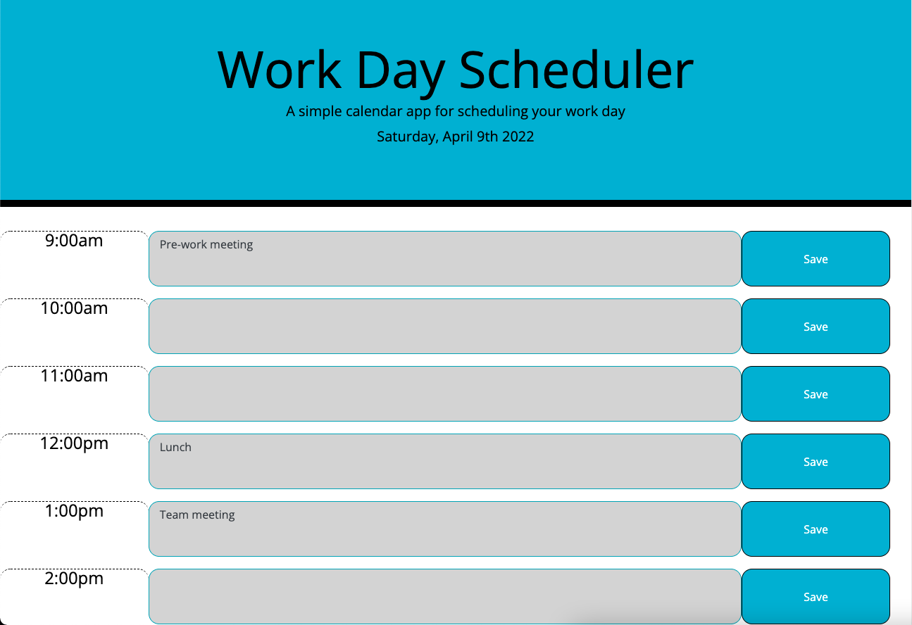

# Work Day Scheduler

## User Story 

-AS AN employee with a busy schedule  
-I WANT to add important events to a daily planner  
-SO THAT I can manage my time effectively  

## Built With 

-HTML  
-CSS  
-Javascript  
-Bootstrap  
-Moment.js  
-JQuery  

## Deployed Project

-https://doolittle28.github.io/work-day-scheduler/  

## Screenshot 

  
-Screenshot of deployed scheduler 

## Credits 

-CSS starter code  
-HTML starter boilerplate  
-https://stackoverflow.com/   
-https://developer.mozilla.org/en-US/  
